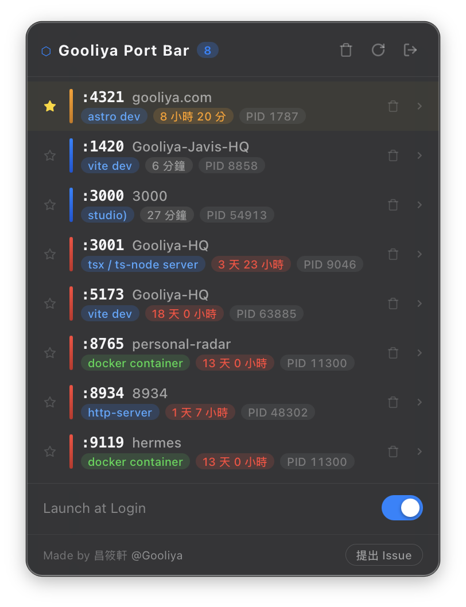
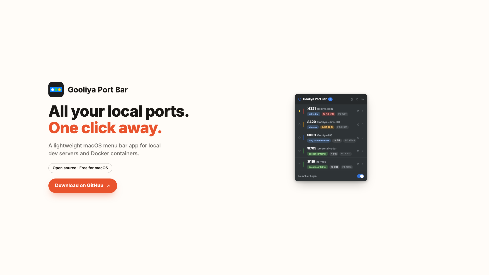

# Gooliya Port Bar


軽量な macOS メニューバー(menu bar)アプリです。ローカルでリッスン中のポート —— npm/Vite/Next/Astro の開発サーバーや Docker コンテナ —— を自動でスキャンし、1つのポップアップにまとめて表示します。ピン留め、名前変更、削除、ブラウザでのワンクリック起動に対応。

English: [README.md](./README.md) | 繁體中文: [README.zh-TW.md](./README.zh-TW.md)

公式サイト: [port-bar.gooliya.com](https://port-bar.gooliya.com/)



[](./assets/demo.mp4)

## 機能

- ローカルでリッスン中の全ポートを一覧表示。Node の開発サーバー(`vite`、`astro`、`next`、`tsx`/`ts-node` など)と Docker コンテナに対応
- ポートをクリックするだけで既定のブラウザで開ける
- よく使う項目をピン留めして、一覧の一番上に固定
- 各項目に分かりやすい表示名を設定できる
- 一覧から直接サービスを削除 —— 対応するプロセス(npm/node)を終了するか Docker コンテナを停止する。実行前に二段階のインライン確認あり
- ヘッダーのボタンで一覧中のすべてのサービスを一括削除。実行前に確認ダイアログを表示
- 各サービスの稼働時間を表示し、放置されていそうなものは色付きタグで知らせる —— 3時間経過でオレンジ、1日経過で赤に変化
- ウィンドウがフォーカスを取り戻すと自動で再スキャン。手動での更新にも対応
- ログイン時の自動起動をオプションで設定可能
- 完全にメニューバーに常駐し、Dock は占有しない
- 単一インスタンスで動作 —— 再度起動しても新しいインスタンスは開かず、既存のウィンドウが前面に表示される

## インストール

1. **Gooliya Port Bar をダウンロード** —— [Releases](https://github.com/imsyuan/gooliya-port-bar/releases/latest) から最新の `.dmg` を入手してください。同じファイルが **Apple Silicon** と **Intel** の両方の Mac に対応しています。
2. **インストール** —— `Gooliya Port Bar.app` を Applications フォルダにドラッグし、ダブルクリックで開いてください。初回起動時は確認画面が表示されるので、「**システム設定 → プライバシーとセキュリティ**」で「**このまま開く**」をクリックし、パスワードまたは Touch ID で確認すれば完了です。以降は確認なしで開けます。

   <details>
   <summary>インストール手順の画像を見る</summary>
   <br>

   
   
   
   
   

   </details>

3. **使ってみる** —— 起動するとメニューバーに常駐します。ローカルの開発サーバーや Docker コンテナが自動でスキャンされ、クリックするだけでブラウザで開けます。

## AI コーディングエージェント向け(MCP)

Gooliya Port Bar には、読み取り専用の独立した [MCP](https://modelcontextprotocol.io/) サーバー実行ファイル(`port-bar-mcp`)も同梱されています。Claude Code のような AI コーディングエージェントが、GUI を開かなくても現在リッスン中のポートを確認できます。通信は stdio のみでネットワークポートは一切開かず、公開するツールも `list_ports` と `list_idle_ports` の2つだけ —— サービスを閉じたり削除したりする手段は提供していません。

まだ `.dmg` の release には同梱されていないため、ソースからビルドしてください:

```bash
cd src-tauri
cargo build --release --bin port-bar-mcp
```

ビルドした実行ファイルを MCP クライアントに指定します。例えば `.mcp.json`:

```json
{
  "mcpServers": {
    "port-bar": {
      "command": "/path/to/gooliya-port-bar/src-tauri/target/release/port-bar-mcp"
    }
  }
}
```

## 技術スタック

- [Tauri v2](https://tauri.app/)(Rust)— ネイティブシェル、tray icon、ウィンドウ管理を担当
- [SvelteKit](https://svelte.dev/) + [Svelte 5](https://svelte.dev/)(runes)— UI を担当し、静的 SPA としてビルド
- ポートスキャンは `lsof`、プロセス情報の取得は `ps` / `docker ps`(いずれも Rust 側で実行)

## 開発

Node.js と、お使いのプラットフォーム向けの [Tauri の前提条件](https://v2.tauri.app/start/prerequisites/)(Rust ツールチェーンなど)が必要です。

この repo には `pre-push` フックが同梱されており、push する前に [gitleaks](https://github.com/gitleaks/gitleaks)(`brew install gitleaks`)で外部に漏れた秘密情報がないかスキャンします。clone 後に一度だけ実行して有効化してください:

```bash
git config core.hooksPath .githooks
```

依存パッケージのインストール:

```bash
npm install
```

フルアプリ(Rust + ネイティブウィンドウ)—— Tauri のコマンドを動かすにはこちらが必須:

```bash
npm run tauri dev
```

フロントエンドのみ、通常のブラウザタブで実行(Tauri バックエンドなし、`invoke()` は失敗します):

```bash
npm run dev
```

フロントエンドの型チェック:

```bash
npm run check
```

## ビルド

```bash
npm run tauri build
```

Rust のユニットテストは `src-tauri/src/lib.rs` にあります:

```bash
cd src-tauri
cargo test
```

## ライセンス

[MIT](./LICENSE)
