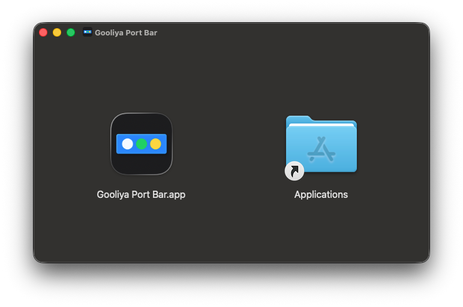
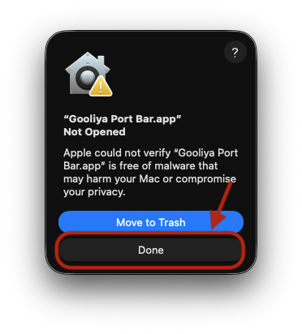
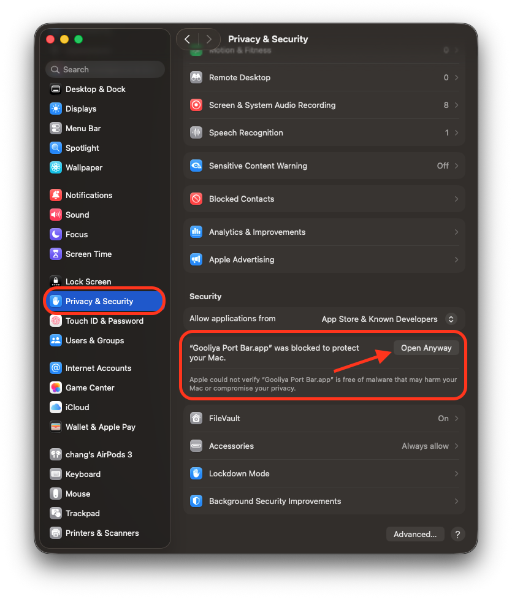
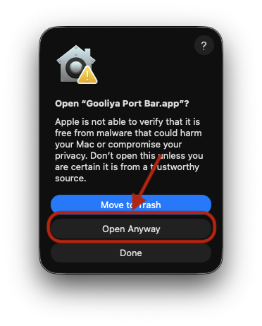
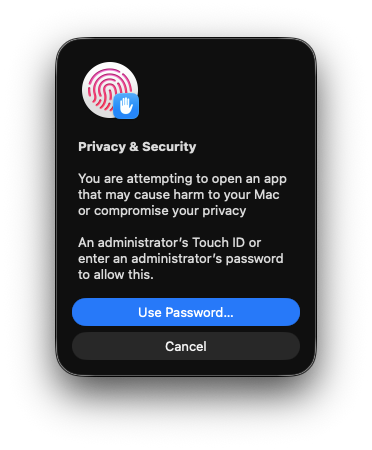

# Gooliya Port Bar


A lightweight macOS menu bar app that scans your locally listening ports — npm/Vite/Next/Astro dev servers and Docker containers — and shows them in one popover, with pin, rename, and one-click open in browser.

繁體中文說明: [README.zh-TW.md](./README.zh-TW.md) | 日本語: [README.ja.md](./README.ja.md)

Website: [port-bar.gooliya.com](https://port-bar.gooliya.com/)

## Features

- Lists all locally listening ports from Node dev servers (`vite`, `astro`, `next`, `tsx`/`ts-node`, ...) and Docker containers
- Click a port to open it in your default browser
- Pin favorites to keep them at the top of the list
- Rename any entry with a custom label
- Remove a service directly from the list — kills the underlying process (npm/node) or stops the Docker container, with a two-step inline confirmation before it acts
- Auto-refreshes when the popover regains focus, or manually via the refresh button
- Optional launch-at-login
- Lives entirely in the menu bar — no Dock icon
- Single-instance — relaunching the app just focuses the existing popover instead of opening a duplicate

## Install

1. **Download Gooliya Port Bar** — grab the latest `.dmg` from [Releases](https://github.com/imsyuan/gooliya-port-bar/releases/latest). The same file works on both **Apple Silicon** and **Intel** Macs.
2. **Install it** — drag `Gooliya Port Bar.app` into your Applications folder, then double-click to open it. The first time, macOS will ask you to confirm — go to **System Settings → Privacy & Security** and click **Open Anyway**, then confirm with your password or Touch ID. You won't be asked again after that.

   <details>
   <summary>See the install screenshots</summary>
   <br>

   
   
   
   
   

   </details>

3. **Start using it** — once open, the app lives in your menu bar. Local dev servers and Docker containers are scanned automatically; click one to open it in your browser.

## Tech Stack

- [Tauri v2](https://tauri.app/) (Rust) for the native shell, tray icon, and window management
- [SvelteKit](https://svelte.dev/) + [Svelte 5](https://svelte.dev/) (runes) for the UI, built as a static SPA
- Port scanning via `lsof` and process inspection via `ps` / `docker ps` on the Rust side

## Development

Requires Node.js and the [Tauri prerequisites](https://v2.tauri.app/start/prerequisites/) (Rust toolchain, etc.) for your platform.

This repo ships a `pre-push` hook that scans outgoing commits for leaked secrets with [gitleaks](https://github.com/gitleaks/gitleaks) (`brew install gitleaks`) before allowing a push. Enable it once after cloning:

```bash
git config core.hooksPath .githooks
```

```bash
npm install

# Full app (Rust + native window) — required to exercise Tauri commands
npm run tauri dev

# Frontend only, in a regular browser tab (no Tauri backend, invoke() calls will fail)
npm run dev

# Type-check the frontend
npm run check
```

## Build

```bash
npm run tauri build
```

Rust unit tests live in `src-tauri/src/lib.rs`:

```bash
cd src-tauri
cargo test
```

## License

[MIT](./LICENSE)
