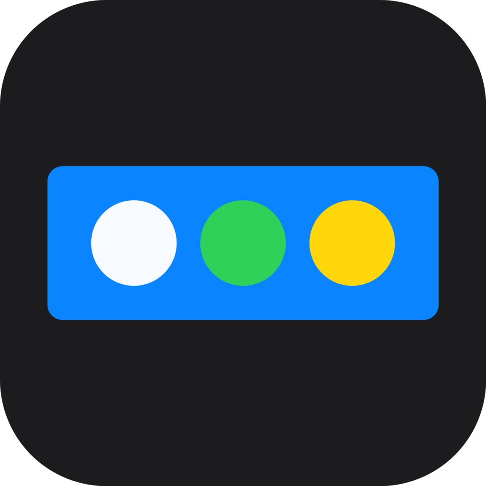

# Gooliya Port Bar



一個輕量的 macOS 選單列(menu bar)小工具,自動掃描本機正在監聽的 port —— npm/Vite/Next/Astro 開發伺服器以及 Docker container —— 集中顯示在一個小視窗裡,支援釘選、改名、一鍵在瀏覽器開啟。

English: [README.md](./README.md)

## 功能

- 列出本機所有正在監聽的 port,包含 Node 開發伺服器(`vite`、`astro`、`next`、`tsx`/`ts-node` 等)與 Docker container
- 點擊 port 項目直接用預設瀏覽器開啟
- 釘選常用項目,固定在清單最上方
- 幫任一項目自訂顯示名稱
- 視窗重新取得焦點時自動重新掃描,也可手動點擊重新整理
- 可選擇開機自動啟動
- 完全常駐選單列,不佔用 Dock
- 單一實例執行 —— 重複啟動 app 只會把現有視窗喚醒並取得焦點,不會開出重複的實例

## 安裝

到 [Releases](https://github.com/imsyuan/gooliya-port-bar/releases) 下載最新的 `.dmg`,開啟後把 **Gooliya Port Bar** 拖進 Applications 資料夾即可。

> 這個 app 沒有用 Apple Developer ID 簽章,第一次開啟會被 Gatekeeper 擋下。對 app 點右鍵 → **打開**,就能繞過這次警告。目前 build 只支援 Apple Silicon(M1/M2/M3/M4)。

## 技術架構

- [Tauri v2](https://tauri.app/)(Rust)負責原生視窗、tray icon 與視窗管理
- [SvelteKit](https://svelte.dev/) + [Svelte 5](https://svelte.dev/)(runes)負責介面,以靜態 SPA 方式建置
- Port 掃描透過 `lsof`,行程資訊透過 `ps` / `docker ps`(皆在 Rust 端執行)

## 開發

需要 Node.js,以及你的平台對應的 [Tauri 前置需求](https://v2.tauri.app/start/prerequisites/)(Rust 工具鏈等)。

```bash
npm install

# 完整 app(Rust + 原生視窗)—— 要測試 Tauri command 一定要用這個
npm run tauri dev

# 只跑前端,在一般瀏覽器分頁開(沒有 Tauri 後端,invoke() 呼叫會失敗)
npm run dev

# 前端型別檢查
npm run check
```

## 建置

```bash
npm run tauri build
```

Rust 單元測試放在 `src-tauri/src/lib.rs`:

```bash
cd src-tauri
cargo test
```

## 授權

[MIT](./LICENSE)
